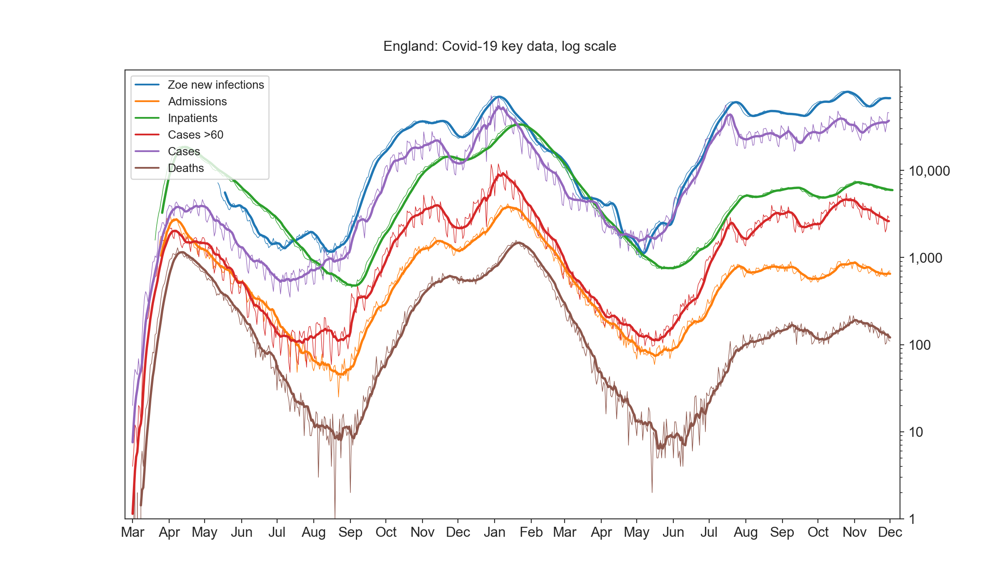
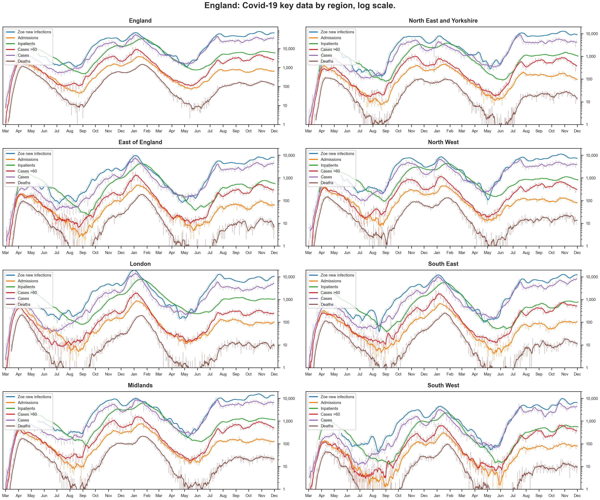

## covid-uk-dashboard
python3 code to export .pngs for (public) UK covid-19 data, national and regional.



```python
python src/covid_chart_generator.py
```
Output .png charts will be saved to `charts` folder.

Various useful modules to build dataframes on specific metrics in `src/modules/dataframe_builder.py`

### Requirements
Python > 3.6  
pandas  
numpy  
matplotlib  
seaborn  
[gcsfs](https://gcsfs.readthedocs.io/en/latest/) (for reading [Zoe](https://covid.joinzoe.com/) data)  
[uk-covid19] (https://pypi.org/project/uk-covid19/)

I'd recommend setting up an environment (easiest with miniconda or similar), then just `pip install pandas numpy matplotlib seaborn gcsfs uk-covid19`


